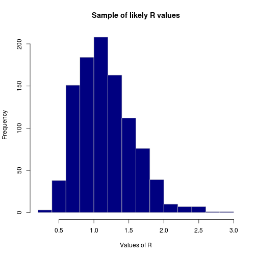

[](https://travis-ci.org/reconhub/earlyR)
[](https://ci.appveyor.com/project/thibautjombart/earlyr/branch/master)
[](https://codecov.io/github/reconhub/earlyR?branch=master)
[](https://cran.r-project.org/package=earlyR)

# Welcome to the *earlyR* package!

This package implements simple estimation of infectiousness, as measured by the
reproduction number (R), in the early stages of an outbreak. This estimation requires:

- **prior knowledge**: the **serial interval** distribution, defined as the *mean* and
*standard deviation* of the (Gamma) distribution. In general, these parameters
are best taken from the literature.

- **data**: the daily **incidence** of the disease, including **only confirmed
    and probable** cases.


## Installing the package

To install the current stable, CRAN version of the package, type:

```r
install.packages("earlyR")
```

To benefit from the latest features and bug fixes, install the development,
*github* version of the package using:


```r
devtools::install_github("reconhub/earlyR")
```

Note that this requires the package *devtools* installed.


# What does it do?

The main features of the package include:

- **`get_R`**: a function to estimate *R* as well as the force of infection over
    time, from incidence data; output is an object of class `earlyR`

- **`sample_R`**: a function to obtain a sample of likely *R* values

- **`plot`**: a function to visualise `earlyR` objects (*R* or force of infection).

- **`points`**: a function using `earlyR` objects to add the force of infection
    to an existing plot.


# Resources

## Worked example

This example is a simplified version of the
[*introductory vignette*](http://www.repidemicsconsortium.org/earlyR/articles/earlyR.html)
(see section below), where `earlyR` is used in conjunction with other packages
to assess infectiousness and growth potential of an early Ebola Virus Disease
(EVD) outbreak. Here, we simply illustrate how `earlyR` can be used for
assessing infectiousness based on a few confirmed/probable cases.

In this example we assume a small outbreak of Ebola Virus Disease (EVD), for
which the serial interval has been previously characterised. We study a fake
outbreak, for which we will quantify infectiousness (R), and then project future
incidence using the package
[*projections*](https://github.com/reconhub/projections).

The fake data we consider consist of confirmed cases with the
following symptom onset dates:


```r
onset <- as.Date(c("2017-02-04", "2017-02-12", "2017-02-15",
                   "2017-02-23", "2017-03-01", "2017-03-01",
		   "2017-03-02", "2017-03-03", "2017-03-03"))		 
```

We assume the current date is 21st March.
We compute the daily incidence using the package
[*incidence*](https://github.com/reconhub/incidence):


```r
library(incidence)
today <- as.Date("2017-03-21")
i <- incidence(onset, last_date = today)
i
```

```
## <incidence object>
## [9 cases from days 2017-02-04 to 2017-03-21]
## 
## $counts: matrix with 46 rows and 1 columns
## $n: 9 cases in total
## $dates: 46 dates marking the left-side of bins
## $interval: 1 day
## $timespan: 46 days
## $cumulative: FALSE
```

```r
plot(i, border = "white")
```


**Note:** It is **very important to make sure that the last days without cases are
included here**. Omitting this information would lead to an over-estimation of the
reproduction number (*R*).


For estimating *R*, we need estimates of the mean and standard deviation of the
serial interval, i.e. the delay between primary and secondary symptom onset
dates. This has been quantified durin the West African EVD outbreak (WHO Ebola
Response Team (2014) NEJM 371:1481–1495):


```r
mu <- 15.3 # mean in days days
sigma <- 9.3 # standard deviation in days
```

The function `get_R` is then used to estimate the most likely values of *R*:

```r
library(earlyR)

res <- get_R(i, si_mean = mu, si_sd = sigma)
res
```

```
## 
## /// Early estimate of reproduction number (R) //
##  // class: earlyR, list
## 
##  // Maximum-Likelihood estimate of R ($R_ml):
## [1] 1.021021
## 
## 
##  // $lambda:
##   0.01838179 0.0273192 0.03514719 0.0414835 0.04623398 0.04946402...
## 
##  // $dates:
## [1] "2017-02-05" "2017-02-06" "2017-02-07" "2017-02-08" "2017-02-09"
## [6] "2017-02-10"
## ...
## 
##  // $si (serial interval):
## A discrete distribution
##   name: gamma
##   parameters:
##     shape: 2.70655567117586
##     scale: 5.65294117647059
```

```r
plot(res)
```


The first figure shows the distribution of likely values of *R*, and the
Maximum-Likelihood (ML) estimation. To derive other statistics for this
distribution, we can use `sample_R` to get a large sample of likely *R* values,
and then compute statistics on this sample:


```r
R_val <- sample_R(res, 1000)
summary(R_val) # basic stats
```

```
##    Min. 1st Qu.  Median    Mean 3rd Qu.    Max. 
##  0.2202  0.8784  1.1011  1.1589  1.4014  2.8228
```

```r
quantile(R_val) # quartiles
```

```
##        0%       25%       50%       75%      100% 
## 0.2202202 0.8783784 1.1011011 1.4014014 2.8228228
```

```r
quantile(R_val, c(0.025, 0.975)) # 95% credibility interval
```

```
##      2.5%     97.5% 
## 0.5500501 2.0022523
```

```r
hist(R_val, border = "grey", col = "navy",
     xlab = "Values of R",
     main = "Sample of likely R values")
```



Finally, we can also represent infectiousness over time using:


```r
plot(res, "lambdas", scale = length(onset) + 1)
abline(v = onset, lwd = 3, col = "grey")
abline(v = today, col = "blue", lty = 2, lwd = 2)
points(onset, seq_along(onset), pch = 20, cex = 3)
```


This figure shows the global force of infection over time, with vertical grey
bars indicating the presence of cases, and dots showing the dates of symptom of
onset. The dashed blue line indicates current day. Note that the vertical scale
for the bars is arbitrary, and only represents the relative force of infection.


## Vignettes

`Currently available vignettes can be accessed from *R* using:

- `vignette("earlyR")`: an
  [introduction to `earlyR`](http://www.repidemicsconsortium.org/earlyR/articles/earlyR.html)
  using a simulated Ebola Virus Disease (EVD) outbreak; includes projections of
  future incidence using *projections*.


## Websites

A dedicated website is still in development.


## Getting help online

Bug reports and feature requests should be posted on *github* using the
[*issue*](http://github.com/reconhub/earlyR/issues) system. All other questions
should be posted on the **RECON forum**: <br>
[http://www.repidemicsconsortium.org/forum/](http://www.repidemicsconsortium.org/forum/)

Contributions are welcome via **pull requests**.

Please note that this project is released with a [Contributor Code of
Conduct](CONDUCT.md). By participating in this project you agree to abide by its
terms.

